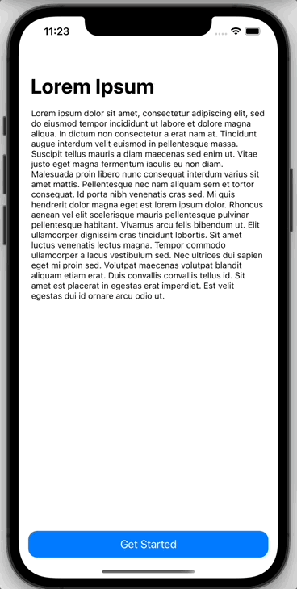

# Description
Draggable UIViewController with UIPanGestureRecognizer to create BottomSheet like UI.

For reference, check this article on <a href="https://betterprogramming.pub/how-to-present-a-bottom-sheet-view-controller-in-ios-a5a3e2047af9">How To Present a Bottom Sheet View Controller in iOS</a> by Mohd Hafiz.

